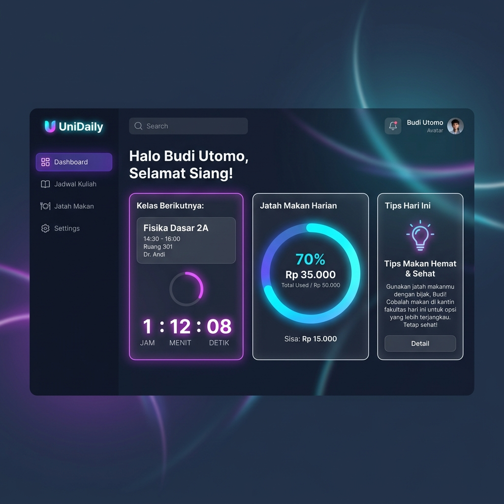

# UniDaily - Smart Student Schedule & Meal Budget Planner

UniDaily adalah aplikasi web asisten mahasiswa untuk membantu mengelola jadwal perkuliahan harian dan memantau jatah anggaran makan harian (untuk makanan siap beli/warung) secara cerdas. 

Aplikasi ini menggunakan teknologi murni sisi klien (*client-side*) dengan tampilan desain **Glassmorphic Dark Mode** yang modern, responsif, dan premium.

---

## 📸 Tampilan Antarmuka (Preview)



---

## ✨ Fitur Utama

1. **Dashboard Pintar (Home):**
   - **Next Class Counter:** Hitung mundur waktu menuju kelas terdekat (misal: "Matematika Komputasi 45 menit lagi di T.3.3").
   - **Interactive Budget Ring:** Diagram lingkaran SVG interaktif yang melacak persentase anggaran makan terpakai hari ini.
   - **Smart Food Advice:** Rekomendasi menu makan otomatis berdasarkan sisa jatah harian Anda (dari cafe mewah, warteg hemat, hingga mie instan kos).
   - **Agenda Hari Ini:** Daftar timeline mata kuliah terjadwal untuk hari yang sedang berjalan.

2. **Jadwal Kuliah (Schedule Board):**
   - Panel jadwal interaktif dari Senin hingga Sabtu.
   - Fitur tambah, ubah, dan hapus kelas dilengkapi modal khusus.
   - Validasi jam kuliah (mencegah jam mulai bentrok atau mendahului jam selesai).

3. **Log & Riwayat Jatah Makan:**
   - Pencatat pengeluaran makan yang dikelompokkan berdasarkan waktu (Sarapan, Makan Siang, Makan Malam, Cemilan).
   - Akumulasi pengeluaran harian otomatis.
   - **Riwayat Pengeluaran (History Log):** Menampilkan rekap pengeluaran hari-hari sebelumnya lengkap dengan menu makanannya.
   - **Rotasi Otomatis:** Sistem akan mengarsipkan log hari ini ke riwayat ketika mendeteksi perubahan tanggal (tengah malam).

4. **Sistem Akun & Keamanan Lokal (Auth System):**
   - Halaman Login dan Registrasi interaktif penuh.
   - **Data Terisolasi:** Setiap akun (*username*) memiliki data jadwal dan budget masing-masing secara privat di browser.
   - **Enkripsi Sandi:** Sandi akun disimpan menggunakan algoritma hash khusus di `localStorage` (bukan teks polos).
   - **Uji Coba Cepat (Username: `jeppp`):** Pendaftaran akun dengan username `jeppp` akan langsung mengimpor jadwal kuliah asli Anda, sedangkan akun baru lainnya akan dimulai dari keadaan kosong bersih.

---

## 🛠️ Stack Teknologi

- **Struktur:** HTML5 (Semantic Layout)
- **Tampilan:** Vanilla CSS3 (Custom Glassmorphism, CSS Variables, Responsive Layout)
- **Logika:** Vanilla JavaScript ES6 (Modular modules: `auth.js`, `schedule.js`, `meals.js`, `app.js`)
- **Penyimpanan:** Browser `localStorage` (Offline-first & Tanpa Server)

---

## 🚀 Cara Menjalankan Proyek

### Cara 1: Buka Langsung (Tanpa Instalasi)
Anda cukup membuka file `index.html` langsung menggunakan browser favorit Anda (Chrome, Edge, Firefox, dll.).

### Cara 2: Menjalankan Server Lokal (Direkomendasikan)
Jika Anda ingin menjalankannya di lingkungan server lokal, jalankan perintah berikut di folder proyek:
```bash
# Menggunakan http-server
npx http-server -p 8080
```
Lalu buka **[http://localhost:8080](http://localhost:8080)** di browser Anda.

---

## 👤 Panduan Uji Coba Cepat

1. Buka aplikasi di browser.
2. Buat akun baru di tab **Daftar Akun** dengan username `jeppp`.
3. Anda akan masuk secara otomatis dan melihat jadwal perkuliahan Anda sudah terisi penuh pada dashboard dan papan jadwal.
4. Anda bisa melakukan log out (Keluar) dan mendaftar menggunakan username lain untuk melihat bahwa data akun baru kosong dan sepenuhnya terisolasi.
